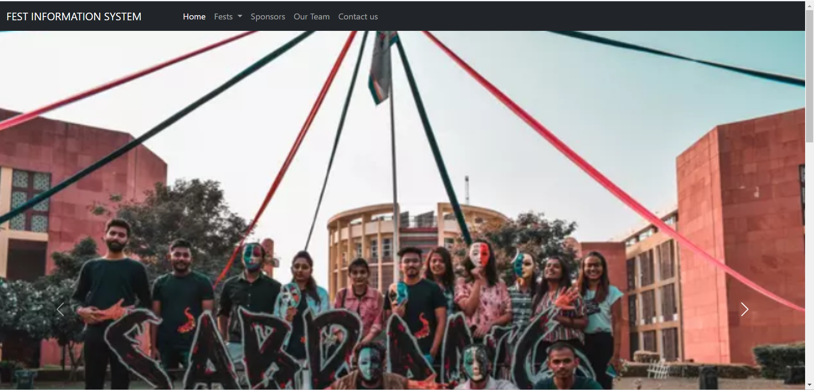
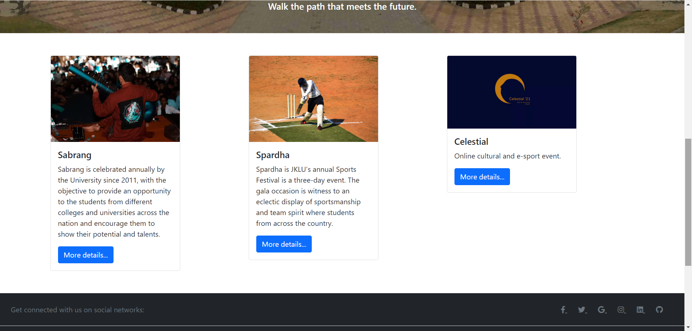
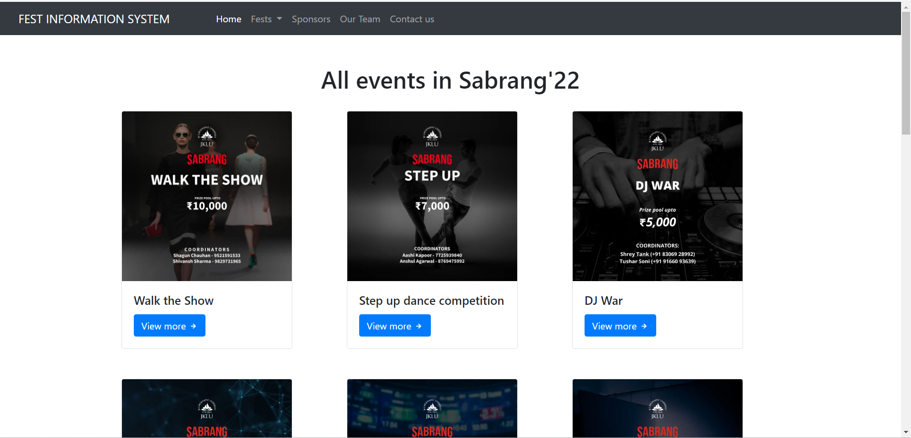
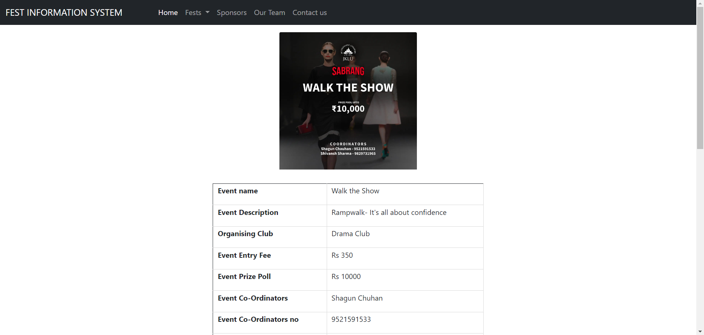

# GatherPro 🎉 

# Fest Information System 🎓

Welcome to **GatherPro**—your ultimate platform for managing and exploring the vibrant fests organized throughout the years!

## 📚 Project Overview

The Fest Information System is a comprehensive tool designed to catalog and manage all aspects of the various fests held at JKLU and other colleges. From the overall structure to the smallest detail, our system ensures that every facet of the fest experience is documented and easily accessible.

### 🛠️ Use Case

- **Comprehensive Event Management:**  
  The system provides a single platform to organize, manage, and retrieve information on any and all events organized by nearby colleges. This centralized approach simplifies the coordination process and makes it easier to access all relevant event data in one place.

- **Empowering Students:**  
  By providing a dedicated space for students, the system enables them to engage more effectively with fest activities, ensuring that they can participate and contribute to the success of these events.

- **Streamlining Coordination:**  
  The system assists coordinators in finding sponsors and participants by referring to previous events of the same type. This historical data is invaluable in securing support and ensuring successful fest execution.

### ✨ Key Features

- **Fest Management:**  
  - **Unique ID:** Each fest is uniquely identified by a Fest ID.
  - **Organizing Committee:** Detailed information about the organizing committee.
  - **Dignitaries:** Profiles of dignitaries who graced the events.
  - **Budget Tracking:** Transparent management of the fest's budget.
  - **Sponsorship:** Information on the sponsors who made the event possible.

- **Event Coordination:**  
  - **Event Listings:** Each fest includes multiple events, each with its own Event ID and name.
  - **Club Involvement:** Events are conducted by various student clubs, showcasing diverse talents.
  - **Coordinators:** Managed by dedicated faculty and student coordinators ensuring smooth operations.

- **Participant Management:**  
  - **Sponsorships:** Events sponsored by different sponsors.
  - **Participant Profiles:** Tracks participants from JKLU and other universities, ensuring everyone gets the spotlight they deserve.

## 📷 Screenshots

Get a glimpse of the Fest Information System in action:

*Visual overview of the website, with quick access to key details.*

*All types of events: cultural, sports and virtual.*

*List of the cultural events organised in year 2022.*

*In-depth view of the events, including event name, entry fees, coordinators, sponsors, etc.*

# 📧 Contact If you have any questions or feedback, feel free to reach out:

Email: shivangiss020@gmail.com

LinkedIn: www.linkedin.com/in/shivangi-shukla20
